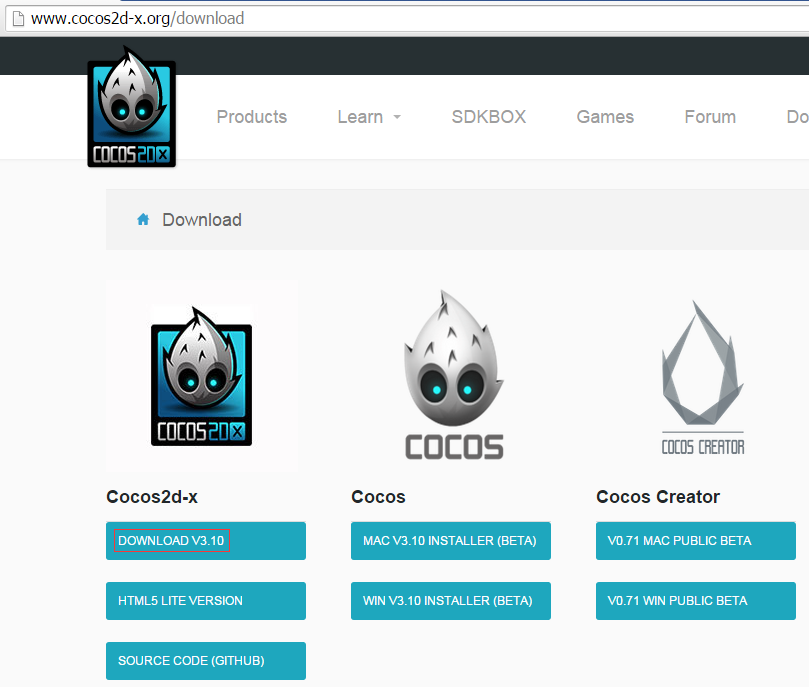
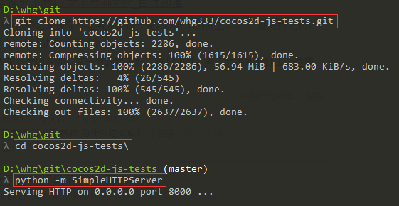
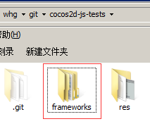
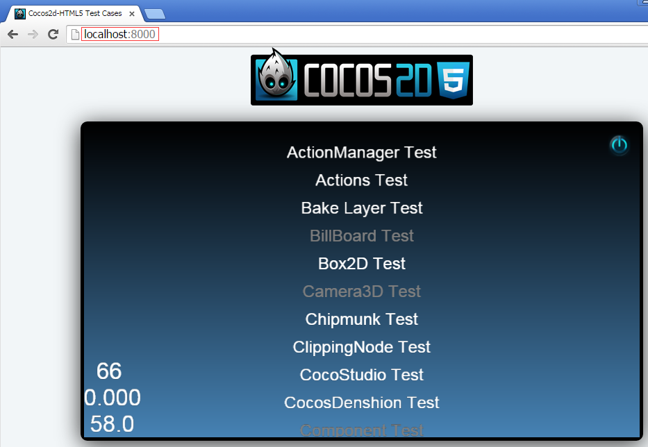

# cocos2d-js-tests
cocos2d-js-tests for **v3.10**

## Step
1. git clone https://github.com/whg333/cocos2d-js-tests.git
2. cd cocos2d-js-tests
3. copy **'frameworks'** to cocos2d-js-tests from your **'cocos2d-x-3.10\tests\js-tests\frameworks'**  or **other cocos2d-js poject**
4. python -m SimpleHTTPServer
5. open http://localhost:8000/ in your chrome

## Snapshot

ensure you had copied **'frameworks'** to cocos2d-js-tests

enjoy~!
